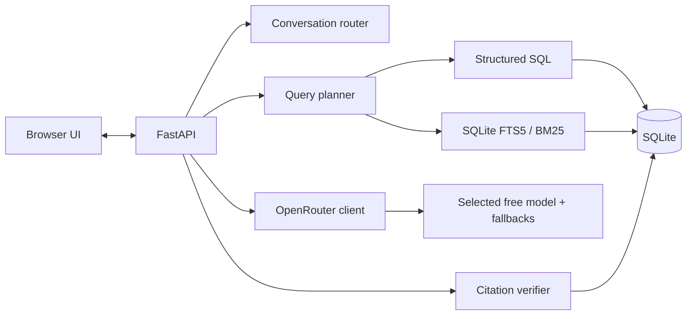
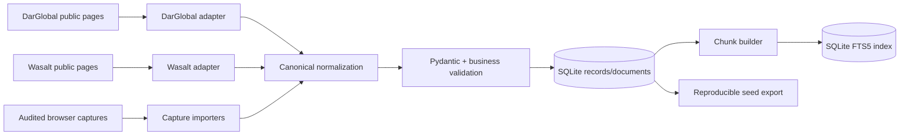

# 02 — System Architecture

This document describes the implemented system. Earlier vector-store and frontend-framework alternatives were resolved during delivery: the released application uses SQLite FTS5/BM25, structured SQL, FastAPI, and a vanilla browser client.

## 1. Runtime architecture



FastAPI serves both the static UI and API from one process. SQLite stores canonical records, supporting documents, indexed chunks, conversations, messages, and scrape metadata. This keeps the runtime small, reproducible, and free of a second database or vector-service dependency.

## 2. Ingestion architecture



Collection is bounded, rate-limited, cached, and re-runnable. Public pages that returned a challenge shell to ordinary HTTP were captured through a standard unauthenticated browser and imported through source-specific, auditable normalizers. A source is deactivated only after complete discovery succeeds, preventing a partial refresh from erasing the last good snapshot.

## 3. Chat request lifecycle

1. FastAPI validates the trimmed message, optional conversation ID, and optional model ID, then applies the request limit.
2. The server restores bounded conversation history and records the user turn.
3. A deterministic router handles greetings, thanks, farewells, and coverage questions without retrieval or a model call.
4. The query planner extracts source, location, category, sale/rent, bedroom, price, ordering, named-entity, content, and follow-up intent.
5. Structured SQL is authoritative for explicit and numeric constraints. FTS5/BM25 handles lexical matching and supporting content.
6. Generic, unspecified-source results are interleaved across DarGlobal and Wasalt when both have candidates. Explicit source requests and global price ordering are not rebalanced.
7. A no-match result returns immediately with no citations and no model call.
8. Retrieved chunks and bounded history are sent to the chosen OpenRouter model. A user selection is attempted first, followed by the configured fallback chain within per-attempt and total time limits.
9. The server verifies every generated citation marker against the exact retrieved set. One strict regeneration is allowed; otherwise the response falls back to deterministic retrieved facts.
10. The completed, verified response is persisted, then returned as JSON or emitted through buffered SSE token events followed by one authoritative `done` event.

Buffering before SSE delivery is intentional: the UI never presents unverified model text as a completed grounded answer.

## 4. Technology decisions

| Layer | Implemented choice | Reason |
|---|---|---|
| Language | Python 3.12 | Shared ecosystem for collection, normalization, API, and tests |
| API | FastAPI + Pydantic | Typed validation, async model calls, OpenAPI, and SSE support |
| Storage | SQLite with WAL and foreign keys | Reproducible and sufficient for this read-heavy assessment corpus |
| Retrieval | Structured SQL + SQLite FTS5/BM25 | Accurate numeric filtering with low memory and no embedding dependency |
| Generation | OpenRouter free chat models | Assessment requirement, configurable selection, bounded fallback |
| Frontend | Vanilla HTML/CSS/JavaScript | Small artifact with no client framework/runtime dependency |
| Packaging | Multi-stage Docker image + Compose | Reproducible startup and one-command local evaluation |

### Why BM25 instead of embeddings?

The initial design allowed local embeddings, but measurement favored FTS5/BM25 for the final target. Real-estate questions contain high-value names, locations, categories, and numbers; the planner resolves those deterministically, while BM25 supplies lexical relevance for descriptions and documents. The recorded service idles at roughly 52 MiB and avoids model downloads, vector persistence, and external embedding calls.

### Why SQL remains authoritative

Semantic similarity is unreliable for “cheapest,” “under 2 million,” bedroom counts, or exact source/location filters. The planner converts those constraints into SQL, preserves global price ordering, and uses lexical retrieval only inside the eligible result set.

### Why citation verification is server-side

The model may only cite IDs present in the turn’s context. The API resolves accepted IDs to canonical URLs stored in SQLite; model-supplied URLs are never trusted. Invalid or missing markers trigger one stricter attempt and then a deterministic fallback.

## 5. Persistence and identity

- `(source_site, source_id)` is the canonical external identity. Identical slugs on different sites cannot collide.
- Listings/projects and content documents use soft deletion so historical citations can return `410 Gone` rather than disappearing ambiguously.
- Conversations and messages are stored server-side; the browser stores its current transcript and conversation ID for refresh continuity.
- A fresh empty data directory is bootstrapped from `data/seed_corpus.json`, then chunks are rebuilt into FTS5.
- Raw captures are audit evidence and development inputs, not runtime retrieval sources.

The canonical schema and SQL DDL are defined in [`04-DATA-SCHEMA.md`](04-DATA-SCHEMA.md).

## 6. Repository layout

```text
backend/app/
  main.py                  routes, middleware, conversational routing, SSE
  config.py                environment-backed settings
  db/database.py           SQLite schema and persistence
  retrieval/planner.py     deterministic intent and SQL planning
  retrieval/service.py     structured + BM25 retrieval and source balance
  generation/openrouter.py model fallback, prompt, citations, degradation
backend/static/             browser application
backend/tests/              automated tests
scraper/                    source adapters, normalizers, capture importers
ingestion/build_index.py    canonical chunks and FTS5 rebuild
data/seed_corpus.json       reproducible startup snapshot
```

## 7. Failure boundaries

| Failure | Behavior |
|---|---|
| Unknown location or unsupported developer | Explicit no-match; no unrelated retrieval |
| Missing API key | Application remains usable with deterministic cited facts |
| Selected model unavailable | Continue through deduplicated configured fallbacks |
| Every model unavailable | Deterministic answer from retrieved records |
| Invalid citation markers | Regenerate once, then deterministic fallback |
| Empty/corrupt corpus | Health endpoint reports degraded; no false readiness |
| Interrupted SSE | Client rejects a stream without `done` and offers retry |
| Partial scrape | Preserve previous active records for the incomplete source |

## 8. Scale boundary

This architecture targets hundreds to low thousands of records and a small number of concurrent reviewers. At materially larger scale, move SQLite to Postgres, add a dedicated search layer or hybrid embeddings, use distributed rate limiting, and separate collection from the web process. Those are upgrade paths, not hidden requirements of the current design.
