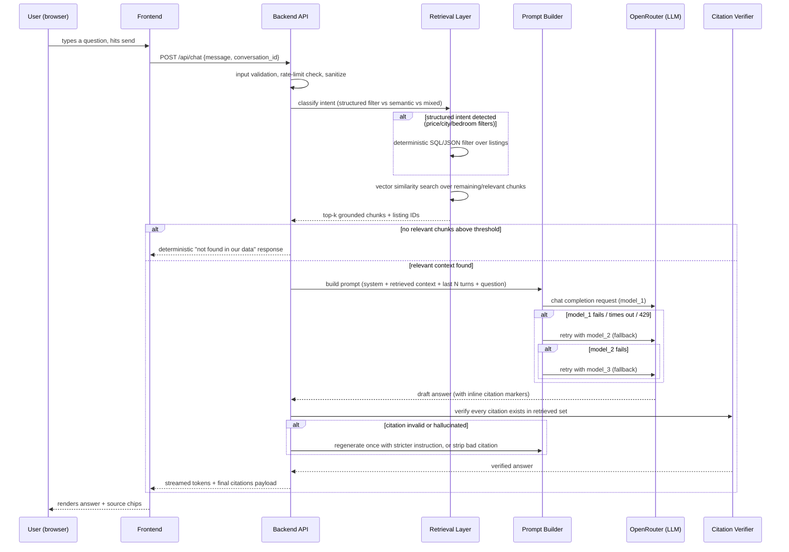

# 02 — System Architecture

## 1. High-level component diagram

```mermaid
flowchart TB
    subgraph Sources["Public Websites (read-only)"]
        DG[DarGlobal\ndarglobal.co.uk]
        WS[Wasalt\nwasalt.sa / wasalt.com]
    end

    subgraph Ingestion["Ingestion Pipeline (offline job, re-runnable)"]
        S1[Scraper: DarGlobal]
        S2[Scraper: Wasalt]
        N[Normalizer\n(maps raw → canonical schema)]
        V[Validator\n(schema + sanity checks)]
        C[Chunker + Embedder]
    end

    subgraph Storage["Persistent Storage"]
        DB[(Structured store\nSQLite/Postgres\nlistings, projects, meta)]
        VEC[(Vector store\nChroma/FAISS\nembedded chunks)]
        RAW[(Raw snapshot store\nHTML/JSON, dev-only)]
    end

    subgraph Backend["Backend API (FastAPI, containerised)"]
        API[/REST + SSE API/]
        RET[Retrieval Layer\n(hybrid: structured filter + vector search)]
        PROMPT[Prompt Builder]
        GEN[Generation Client\n(OpenRouter, model fallback chain)]
        VER[Citation Verifier]
    end

    subgraph Frontend["Frontend (static SPA or SSR, containerised or CDN-served)"]
        UI[Chat UI]
    end

    subgraph External["External Services"]
        OR[OpenRouter API\nfree model(s)]
    end

    DG --> S1 --> N
    WS --> S2 --> N
    N --> V --> DB
    V --> C --> VEC
    S1 -.dev only.-> RAW
    S2 -.dev only.-> RAW

    UI <--> API
    API --> RET
    RET --> DB
    RET --> VEC
    RET --> PROMPT
    PROMPT --> GEN
    GEN --> OR
    GEN --> VER
    VER --> DB
    VER --> API
```

## 2. Request lifecycle (a single chat turn)



## 3. Technology stack — decision record

| Layer | Choice | Rationale | Alternatives considered |
|---|---|---|---|
| Language (backend + scraper) | **Python 3.12** | Best ecosystem for scraping (httpx/Playwright/BeautifulSoup), embeddings (sentence-transformers), and RAG orchestration; single language reduces surface area for a short assignment. | Node.js/TypeScript (viable, weaker scraping ergonomics without extra deps); Go (fast, but poor RAG/embedding ecosystem). |
| Backend framework | **FastAPI** | Async-native (needed for concurrent scrape + streaming LLM calls), automatic OpenAPI docs (doubles as living API spec for reviewers), Pydantic validation matches the schema doc directly. | Flask (no native async/streaming ergonomics), Django (too heavy for this scope). |
| Scraping | **httpx + BeautifulSoup4** for ordinary public HTTP responses; a separately audited **standard-browser capture importer** for public pages that a WAF serves only to a normal browser session | Keeps the runtime and scraper containers lean while preserving robots checks, bounded fetching, challenge detection, and an auditable fallback snapshot. In the verified run, DarGlobal's plain-HTTP path returned an Incapsula shell while its public pages loaded without authentication in a standard browser; Wasalt discovery used public sitemap XML and persisted only genuine detail-page facts. | Bundling Playwright/Selenium into the deployed image (heavier and still not authorization to bypass challenges); Scrapy (overkill for the bounded corpus). |
| Structured storage | **SQLite** (file-backed, in the container/volume) for the assignment scale; document the Postgres upgrade path | Zero external dependency, trivially containerised, sufficient for hundreds–low-thousands of rows. Free managed Postgres (e.g. a host's free tier) is an acceptable substitute if the chosen hosting platform provides one — record the actual choice made in `docs/08-DEPLOYMENT.md`. | Postgres (better for concurrent writes/scale, adds an external managed dependency and cost risk on free tiers). |
| Vector store | **Chroma (embedded/local, persisted to disk)** as default; document a hosted-free-tier alternative (e.g. a vector DB's free tier) as fallback if embedded storage is incompatible with the chosen host's filesystem persistence model | No external service, no API key, works fully offline once embeddings are computed, persists to a Docker volume. | FAISS (great performance, more manual metadata bookkeeping); pgvector (great if already running Postgres); a managed vector DB free tier (adds external dependency + potential cold-start/quota issues — keep as documented fallback, not primary). |
| Embeddings | **Local `sentence-transformers` model** (e.g. a small, permissively-licensed all-MiniLM-class model) run inside the container at ingestion time — zero cost, no external API, no rate limits | Keeps the "free" constraint airtight and avoids depending on an embeddings API that may not be free or may rate-limit. Model size must be checked to fit comfortably in the deploy target's memory budget (see `docs/08-DEPLOYMENT.md` §Resource sizing); if too large, fall back to a lightweight TF-IDF/BM25 keyword index (still fully valid retrieval, slightly lower semantic recall) rather than skip retrieval entirely. | OpenAI/other paid embeddings APIs (cost, against the "free" spirit even if backend uses OpenRouter for generation); an OpenRouter embeddings endpoint if/when available for free (verify at build time; use if it exists and is genuinely free, else keep local). |
| Generation (LLM) | **OpenRouter**, `:free`-suffixed model(s), selected at build/runtime — see `docs/05-CHATBOT-RAG-SPEC.md` for the exact model shortlist and fallback chain | Explicit assignment requirement. | N/A — mandated by the brief. |
| Frontend | **Static single-page app** — plain React + TypeScript (Vite) OR a minimal server-rendered template if the builder wants to avoid a Node build step; either is acceptable as long as `docs/07-FRONTEND-SPEC.md` requirements are met | Chat UIs are well-served by a small SPA; a static build can be served by the same FastAPI process (mounted static files) to avoid running two containers/hosts if the hosting target charges per service. | Next.js (fine, but adds SSR complexity not needed for a client-only chat widget); server-rendered Jinja2 + vanilla JS (simplest possible, valid if time-constrained — must still meet streaming/UX requirements). |
| Containerisation | **Docker**, multi-stage build; **docker-compose** for local/full-stack orchestration (api service + optional ingestion one-off job service) | Explicit assignment requirement; multi-stage keeps final image small (build deps vs runtime deps separated). | N/A — mandated by the brief. |
| Hosting/deployment | See `docs/08-DEPLOYMENT.md` §Hosting comparison for the full evaluated list and final choice | Must be free/near-free, must support a long-running container process (rules out pure serverless-function-only platforms unless adapted), must give a stable public HTTPS URL. | — |

## 4. Data flow: from raw HTML to a citable answer

1. **Fetch** — scraper requests a page (respecting robots.txt + delay), gets raw HTML.
2. **Parse** — CSS-selector/XPath extraction into a raw dict per page (source-specific parser).
3. **Normalize** — raw dict mapped into the canonical `Listing`/`Project` schema (`docs/04-DATA-SCHEMA.md`); currency/units normalized (AED/SAR/USD kept as `price_amount` + `price_currency`, never silently converted); missing fields explicitly `null`, never guessed.
4. **Validate** — Pydantic model validation + business-rule checks (e.g. price ≥ 0, area > 0 if present, valid enum for `listing_type`); failed records are logged and excluded, not silently coerced.
5. **Persist (structured)** — upsert into SQLite by `source_id` (stable per-source identifier, e.g. slug or listing ID from the URL).
6. **Chunk** — build a small set of natural-language text chunks per record (title+description+key facts as prose, features/amenities as a separate chunk, so retrieval can match either high-level or detail-level questions).
7. **Embed** — compute embeddings for each chunk; store vector + metadata (`source_id`, `source_site`, `chunk_type`, `url`) in the vector store.
8. **Retrieve (at query time)** — hybrid: structured filters applied first when the query implies them (price/city/bedrooms/type), then vector similarity search within (or across, if no filter applies) the corpus; top-k chunks returned with metadata.
9. **Prompt** — system instructions + retrieved chunks (with explicit IDs) + trimmed conversation history + user question assembled into a bounded-length prompt.
10. **Generate** — sent to OpenRouter primary free model; on failure, fallback chain kicks in.
11. **Verify** — response's cited `source_id`s checked against what was actually retrieved; unverifiable citations stripped or trigger one regeneration attempt.
12. **Respond** — streamed to the frontend with a structured citations array the UI renders as clickable source chips.

## 5. Module/repo layout

```
estatebot/
├── README.md
├── SUBMISSION.md
├── CHECKLIST.md
├── docs/
│   ├── 01-SPEC.md
│   ├── 02-ARCHITECTURE.md
│   ├── 03-DATA-SCRAPING-SPEC.md
│   ├── 04-DATA-SCHEMA.md
│   ├── 05-CHATBOT-RAG-SPEC.md
│   ├── 06-API-SPEC.md
│   ├── 07-FRONTEND-SPEC.md
│   ├── 08-DEPLOYMENT.md
│   ├── 09-TESTING-QA.md
│   └── 10-EDGE-CASES.md
├── backend/
│   ├── app/
│   │   ├── main.py                  # FastAPI app, routes
│   │   ├── config.py                # env var loading/validation (pydantic-settings)
│   │   ├── models/                  # Pydantic schemas (Listing, Project, ChatRequest, ...)
│   │   ├── db/                      # SQLite/SQLAlchemy models + migrations
│   │   ├── retrieval/               # structured filter engine + vector search wrapper
│   │   ├── generation/              # OpenRouter client, model fallback chain, prompt templates
│   │   ├── verification/            # citation verifier
│   │   └── api/                     # route handlers (chat, health, stats, listings)
│   ├── tests/
│   ├── requirements.txt
│   └── Dockerfile
├── scraper/
│   ├── darglobal/
│   │   ├── spider.py                # page discovery (projects list, press list)
│   │   ├── parsers.py               # per-page-type HTML → raw dict
│   │   └── run.py                   # CLI entrypoint
│   ├── wasalt/
│   │   ├── spider.py
│   │   ├── parsers.py
│   │   └── run.py
│   ├── common/
│   │   ├── http.py                  # rate-limited, retrying HTTP client + robots.txt check
│   │   ├── normalize.py             # shared normalization helpers (currency, area units)
│   │   └── storage.py               # writes to SQLite + triggers embedding pipeline
│   ├── requirements.txt
│   └── Dockerfile                   # optional: run scraper as its own image/job
├── ingestion/
│   └── build_index.py               # chunk + embed + populate vector store (post-scrape)
├── frontend/
│   ├── src/
│   ├── package.json
│   └── Dockerfile                   # or served as static files from backend image
├── data/                            # gitignored at runtime; volume-mounted in compose
│   ├── raw/                         # dev-only raw HTML/JSON snapshots
│   ├── estatebot.db                 # SQLite file
│   └── vector_store/                # Chroma persistence dir
├── docker-compose.yml
├── .env.example
└── .dockerignore
```

## 6. Key architectural decisions worth defending to a reviewer

1. **Why RAG instead of fine-tuning?** Fine-tuning a free-tier model is impractical (no free fine-tuning infra for most OpenRouter free models, and data changes whenever the sites change). RAG keeps the system trivially refreshable (re-scrape → re-embed → same model) and is the industry-standard pattern for "chatbot over our own data."
2. **Why hybrid retrieval, not pure vector search?** Real-estate questions are frequently numeric/comparative ("cheapest", "under $1M", "3+ bedrooms") — semantic similarity alone is unreliable for that; deterministic filtering handles it correctly and cheaply, vector search handles the fuzzy/descriptive remainder.
3. **Why local embeddings instead of an API?** Keeps the "free" requirement airtight (no risk of an embeddings API's free tier vanishing or rate-limiting mid-review) and removes an external dependency from the critical path.
4. **Why a model fallback chain instead of one hardcoded model?** OpenRouter free models are explicitly documented (by OpenRouter itself) as subject to rate limits, deprecation, and availability changes without notice. A single hardcoded model string is a single point of failure the reviewer could hit by bad luck (e.g. testing during a rate-limit window). The fallback chain is not gold-plating — it's the difference between "works when I demoed it" and "works when the reviewer tests it."
5. **Why verify citations post-generation instead of trusting the model?** Even with RAG, models can still cite the wrong listing or invent a detail. A cheap post-hoc check (does the cited ID exist in what was retrieved?) meaningfully reduces hallucination risk for near-zero cost.
6. **Why SQLite + embedded Chroma instead of managed cloud services?** Zero external cost, zero extra signup/API-key surface area, fully reproducible via `docker compose up`, and sufficient for the corpus scale defined in `docs/01-SPEC.md` §7. The upgrade path to Postgres/pgvector or a hosted vector DB is documented, not required.

## 7. Scaling & future-work notes (not required for the assignment, stated for completeness)

- Swap SQLite → Postgres and Chroma → pgvector for concurrent multi-instance deployment.
- Add a scheduled re-scrape (cron/GitHub Actions) instead of manual re-runs.
- Add per-source incremental diffing (only re-embed changed pages) instead of full rebuild.
- Add a reranker stage between vector search and prompt assembly for higher precision at larger corpus sizes.
- Multi-language (Arabic) UI and retrieval, since a meaningful share of source content is Arabic-only.
